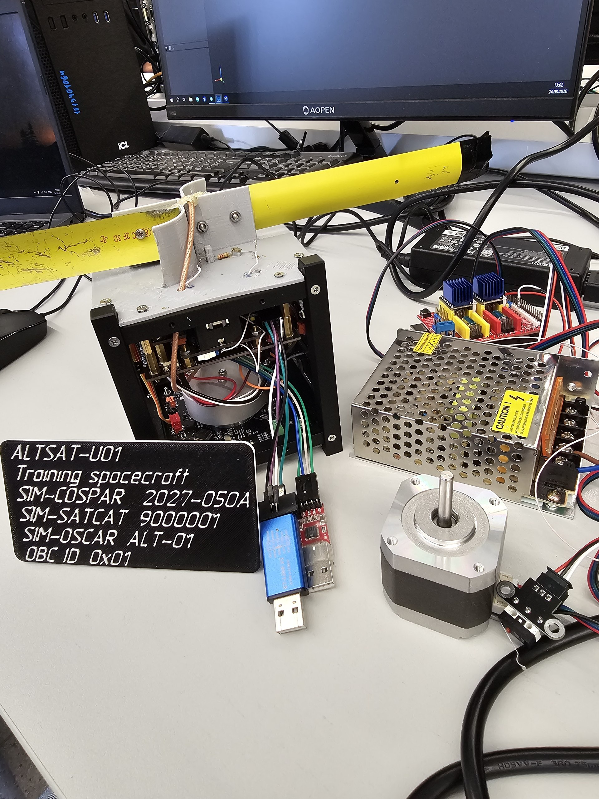

# ЦУП Альтаир

<p align="center">
  
</p>

**ЦУП Альтаир** — учебный центр управления полётами для CubeSat-проектов: приём телеметрии, отображение параметров, графики для нескольких аппаратов, сырой COM-терминал, радиопередача команд и работа с поворотным устройством.

**Текущая версия: v8 / 0.8.0.**  
Проект создан в рамках образовательного проекта **«Миссия на Луну»** и профильной смены по спутникостроению; стенд использовался на Технопроме-2026.

## Скачать

### 1. Наземный ЦУП

- **[Программа ЦУП Альтаир v8 для Windows](https://github.com/Anton778/OpenMCC/releases/download/v0.8.0/CUP-Altair-Setup-0.8.0.exe)**
- [Скетч радиошлюза для ESP32-WROOM-32](firmware/ground_station/esp32/Altair_Ground_ESP32/Altair_Ground_ESP32.ino)
- [Скетч радиошлюза для Arduino Uno](firmware/ground_station/arduino_uno/Altair_Ground_Arduino_Uno/Altair_Ground_Arduino_Uno.ino)
- [Скетч радиошлюза для Arduino Nano](firmware/ground_station/arduino_nano/Altair_Ground_Arduino_Nano/Altair_Ground_Arduino_Nano.ino)

### 2. Спутник

- [Скетч спутника IntroSat для STM32F103C8T6 / Blue Pill](firmware/satellite/stm32/Altair_Satellite_STM32/Altair_Satellite_STM32.ino)
- [Скетч спутника для Arduino Nano](firmware/satellite/arduino_nano/Altair_Satellite_Arduino_Nano/Altair_Satellite_Arduino_Nano.ino)

### 3. Руководство

- [Руководство пользователя ЦУП Альтаир v8, PDF](https://github.com/Anton778/OpenMCC/releases/download/v0.8.0/CUP_Altair_v8_Manual.pdf)

## Как выглядит система

<table>
<tr>
<td width="50%" valign="top">

<br><b>Наземный ЦУП.</b> Большой экран с программой, направленная антенна, радиошлюз ESP32 + CC1101 и в планах поворотное устройство.
</td>
<td width="50%" valign="top">

<br><b>Учебный аппарат.</b> CubeSat с бортовой электроникой и раскрывающейся ленточной антенной.
</td>
</tr>
</table>

## Быстрый запуск

1. Подключите CC1101 к ESP32-WROOM-32 по таблице ниже.
2. Загрузите `Altair_Ground_ESP32.ino` через Arduino IDE **или** прошейте ESP32 встроенной прошивкой из программы.
3. Подключите ESP32 к компьютеру по USB.
4. Запустите `ЦУП Альтаир`.
5. В блоке **«Соединение с ЦУПом»** выберите ESP32 и `115200 бод`.
6. Нажмите **«Подключить устройство»** и выберите нужный COM-порт.
7. После подключения блок соединения автоматически свернётся; его можно развернуть в любой момент.
8. Включите спутники-передатчики. Телеметрия появляется сразу; разные `ID` строятся разными линиями на одних графиках.
9. Для диагностики откройте панель **COM** — там видны сырые строки в реальном времени.

## Радиопрофиль

Наземный шлюз v8 использует профиль, который устойчиво работал на реальном стенде:

| Параметр | Значение |
|---|---:|
| Частота | **435.000 МГц** |
| Модуляция | 2-FSK |
| Скорость в эфире | 4.8 kbps |
| Девиация | 5 кГц |
| Полоса RX | **203 кГц** |
| Sync word | `0x12AD` |
| Encoding | NRZ |
| Длина пакета | variable |
| CRC CC1101 | включён |
| USB | 115200 бод |

Широкая полоса **203 кГц** выбрана намеренно: на стенде некоторые модули имели заметный частотный уход относительно 435.000 МГц. В v8 этот профиль наземного CC1101 **зафиксирован**, чтобы у разных пользователей программа запускалась в одинаковой проверенной конфигурации. В интерфейсе параметры видны, но случайно изменить их нельзя.

## Подключение CC1101

Для приёма телеметрии и передачи команд используется **один и тот же радиомодуль CC1101**. Это приёмопередатчик: отдельные модули для приёма и передачи не требуются. CC1101 работает в полудуплексном режиме, поэтому управляющий микроконтроллер программно переключает его между режимами RX и TX.

<p align="center">
  
</p>

> **Особенность IntroSat.** В наборах спутников IntroSat применяется та же микросхема CC1101, однако радиомодуль выполнен на собственной печатной плате. Поэтому расположение контактов и способ подключения могут отличаться от показанного выше модуля; необходимо проверять маркировку и документацию конкретной ревизии платы.
>
> На профильной смене выяснилось, что на использовавшемся шилде IntroSat не все необходимые линии радиомодуля были разведены на штатный разъём. Для рабочего подключения отдельно припаивались три провода: `CSN / CS → PA2`, `GDO0 → PA0` и `GDO2 → PA1`. Линии `SCK`, `MISO` и `MOSI` подключались к штатному интерфейсу SPI1 микроконтроллера STM32. Перед пайкой следует сверить эти назначения с прошивкой и ревизией конкретной платы IntroSat.

### ESP32-WROOM-32

Это штатный вариант радиошлюза ЦУП Альтаир.

| CC1101 | ESP32-WROOM-32 |
|---|---|
| VCC | 3V3 |
| GND | GND |
| SCK | GPIO18 (D18) |
| MISO / SO | GPIO19 (D19) |
| MOSI / SI | GPIO23 (D23) |
| CSN / CS | GPIO21 (D21) |
| GDO0 | GPIO4 (D4) |
| GDO2 | GPIO27 (D27) |

> `GPIO18` и `D18` — это один и тот же вывод ESP32. На разных платах и в разных средах он может быть подписан как `18`, `GPIO18` или `D18`; аналогично для остальных выводов таблицы.

### Arduino Nano *

Этот вариант удобен для простого передатчика или стендовой проверки радиолинии.

| CC1101 | Arduino Nano |
|---|---|
| VCC | **3.3V** |
| GND | GND |
| SCK | D13 |
| MISO / SO | D12 |
| MOSI / SI | D11 |
| CSN / CS | D10 |
| GDO0 | D2 |
| GDO2 | D3 |

**\* Важно:** классический Arduino Nano на ATmega328P обычно работает с логическими уровнями **5 В**, а CC1101 — с логикой **3.3 В**. Линии от Nano к CC1101 (`SCK`, `MOSI`, `CS`) рекомендуется подключать **через преобразователь уровней 5 В ↔ 3.3 В**. Прямое подключение без согласования уровней — только на свой страх и риск. Сам CC1101 питать исключительно от **3.3 В**.

### STM32F103C8T6 Blue Pill (установлена в CubeSat)

Таблица соответствует разводке, используемой в эталонном скетче передатчика проекта: `CS=PA2`, `GDO0=PA0`, `GDO2=PA1`, SPI1 — штатные выводы Blue Pill.

| CC1101 | STM32 Blue Pill |
|---|---|
| VCC | 3.3V |
| GND | GND |
| SCK | PA5 |
| MISO / SO | PA6 |
| MOSI / SI | PA7 |
| CSN / CS | PA2 |
| GDO0 | PA0 |
| GDO2 | PA1 |

**CC1101 питается только от 3.3 В.** Для ESP32 и STM32 Blue Pill отдельный преобразователь логических уровней не требуется, поскольку обе платы работают с логикой 3.3 В.

> Выводы `CS`, `GDO0` и `GDO2` можно назначить иначе, но тогда те же номера необходимо изменить в прошивке. Таблицы выше соответствуют конфигурациям, используемым в проекте ЦУП Альтаир.

## Телеметрия

Базовый пакет:

```text
02,00001,00015,3.00,4.20,1,33
```

Поля:

```text
ID,PACKET,UPTIME,PANEL_POWER,VOLT,MODE,CHECKSUM
```

Поддерживается и расширенный вариант с состоянием раскрытия антенны:

```text
02,00001,00015,3.00,4.20,1,1,33
```

Поля:

```text
ID,PACKET,UPTIME,PANEL_POWER,VOLT,MODE,ANTENNA,CHECKSUM
```

где `ANTENNA=1` — раскрыта, `ANTENNA=0` — сложена. Если поля `ANTENNA` нет, интерфейс показывает **Н/Д**.

### Важно про контрольную сумму

В v8 **прикладная XOR-проверка намеренно отключена**. Поле `CHECKSUM` сохраняется и отображается, но не является причиной отбрасывания пакета.

Это сделано для учебной смены: команда может изменить `ID`, напряжение или другое поле и не пересчитывать последние два HEX-символа — пакет всё равно будет показан в ЦУПе.

Аппаратный **CRC самого CC1101 остаётся включённым** и защищает радиопакет от грубых ошибок передачи.

## Несколько спутников одновременно

ЦУП группирует данные по `ID`.

Если одновременно приходят:

```text
01,...
02,...
07,...
```

на каждом графике будут отдельные линии `ID 01`, `ID 02`, `ID 07`. Цвет закрепляется за ID на текущую сессию. Точки показывают фактические моменты поступления пакетов. Кнопка **«Сбросить принятые данные»** очищает карточки, графики, счётчики и сырой COM-журнал.

## Передача команд с ЦУПа

ESP32-шлюз v8 работает как приёмопередатчик. В программе можно выбрать адресат (`ALL` или конкретный ID) и передать команду.

ЦУП отправляет шлюзу:

```text
$CMD,RF,TO=02,NAME=PING
```

а ESP32 передаёт в эфир:

```text
$CMD,TO=02,NAME=PING
```

Штатные команды v8:

| Команда | Назначение |
|---|---|
| `PING` | проверка радиопередачи |
| `INFO` | запрос информации |
| `TM_START` | команда запуска телеметрии |
| `TM_STOP` | команда остановки телеметрии |
| `TM_PERIOD,MS=<N>` | изменение периода телеметрии |
| `USER,DATA=<текст>` | произвольная пользовательская команда |

> Бортовая прошивка спутника должна отдельно реализовать реакцию на эти команды. Даже без неё передачу ЦУПа можно увидеть на SDR и проверить TX-тракт CC1101.

Служебная команда `$CMD,RADIO_STATUS` возвращает текущий фиксированный профиль наземного шлюза. Старые команды изменения радиопрофиля в v8 намеренно не применяются.

## Почему данные могут обновляться реже, чем ожидается

Программа не вводит специальную задержку отображения: разобранная строка сразу отправляется в карточки и графики.

Причины редкого обновления обычно находятся ниже по тракту: реальный период передачи конкретного спутника, коллизии нескольких аппаратов на одной частоте, частотный уход передатчика, занятый COM-порт или потеря радиопакета по аппаратному CRC.

Для проверки используется панель **«Сырые данные последовательного порта»**. Если строки быстро идут в COM-панели, но не отображаются как телеметрия — проблема в формате пакета. Если строк в COM-панели нет — искать нужно в радиоканале/ESP32.

## Что нового в v8

- официальная ESP32-прошивка без прикладной проверки XOR;
- RX bandwidth 203 кГц;
- видимая на главном экране частота `435.000 МГц`;
- сворачиваемая панель соединения;
- передача RF-команд с ЦУПа;
- кнопка полного сброса принятых данных;
- отдельные линии и цвета графиков для каждого `ID`;
- сырой COM-терминал;
- окно **«О программе»**;
- новый значок Альтаира для интерфейса и Windows-приложения;
- фотографии реального ЦУПа и CubeSat в документации;
- один актуальный GitHub Release — **v0.8.0**.

## О программе

**Автор: Антон Т.**

Сделано в рамках проекта **«Миссия на Луну»** к профильной смене по спутникостроению.  
Цель проекта — дать участникам понятный и воспроизводимый наземный комплекс, который можно собрать из доступных модулей, увидеть реальные радиопакеты и использовать как основу для собственных спутниковых экспериментов.

## Разработка

Репозиторий содержит приложение, прошивки и документацию. Для локального запуска:

```bash
npm install
npm start
```

Для сборки Windows installer:

```bash
npm run dist:win
```

Pull request'ы и улучшения приветствуются. При изменении радиопротокола желательно приложить пример принятой сырой строки из COM-панели.

## Обратная связь

Если у вас есть вопросы, предложения или идеи по улучшению проекта, пишите на электронную почту: [ya.antoha.rt@gmail.com](mailto:ya.antoha.rt@gmail.com)
